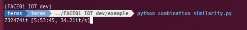

# 顔データセットの間違い探し 失敗編②
前回の記事では、マシンが熱暴走して何回かブラックアウトするという屈辱を味わいました。今回は、その続きです。


:::message
この記事で紹介している方法で、顔データセットの間違い探しを行いましたが、処理時間が異常に長く、またCPU温度により何回かフリーズしました。ですので、以降の記事を「失敗編②」としました。
:::

前回の記事
file:///tmp/mume202385-938130-vjtybt.xivd.html

前回の手法では、顔画像から特徴ベクトルを取得し、その後組み合わせを作成していました。そこで今回は、特徴ベクトルを作成する段階と、組み合わせからコサイン類似度を計算する段階を分けてみました。
## 特徴量の取得
```python
# Operate directory: Common to all examples
import os.path
import sys
dir: str = os.path.dirname(__file__)
parent_dir, _ = os.path.split(dir)
sys.path.append(parent_dir)

from face01lib.load_preset_image import LoadPresetImage

load_preset_image_obj = LoadPresetImage()

root_dir: str = "/media/terms/2TB_Movie/face_data_backup/data"
# root_dir: str = "/home/terms/ドキュメント/find_similar_faces/test"

sub_dir_list: list = os.listdir(root_dir)
for sub_dir in sub_dir_list:
    sub_dir = os.path.join(root_dir, sub_dir)
    load_preset_image_obj.load_preset_image(
        deep_learning_model=1,
        RootDir=sub_dir,  # npKnown.npzを作成するディレクトリ
        preset_face_imagesDir=sub_dir  # 顔画像が格納されているディレクトリ
    )
```

## 組み合わせからコサイン類似度を計算する
```python
import csv
import os
import sys
from typing import List

import cupy as cp
import dlib
import numpy.typing as npt
from tqdm import tqdm

# モジュールのパスを追加
sys.path.append("/home/terms/bin/FACE01_IOT_dev")
from face01lib.api import Dlib_api
from face01lib.utils import Utils  # type: ignore

Utils_obj = Utils()
api_obj = Dlib_api()

def calculate_cosine_similarity(api_obj, file_path1, file_path2):
    encoding_list = []
    for face_path in [file_path1, file_path2]:
        img = dlib.load_rgb_image(face_path)  # type: ignore
        face_locations: List = api_obj.face_locations(img, mode="cnn")
        face_encodings: List[npt.NDArray] = api_obj.face_encodings(
            deep_learning_model=1,
            resized_frame=img,
            face_location_list=face_locations
        )
        encoding_list.append(face_encodings[0])

    emb0 = encoding_list[0].flatten()
    emb1 = encoding_list[1].flatten()
    cos_sim = cp.dot(emb0, emb1) / (cp.linalg.norm(emb0) * cp.linalg.norm(emb1))
    return cos_sim

def generate_combinations(api_obj):
    os.chdir("/media/terms/2TB_Movie/face_data_backup/")
    parent_dir = "data"
    sub_dirs = [os.path.join(parent_dir, d) for d in os.listdir(parent_dir) if os.path.isdir(os.path.join(parent_dir, d))]

    CPU_cnt = 0
    # 保存先のCSVファイルを開く
    with open('output.csv', 'w', newline='') as csvfile:
        csv_writer = csv.writer(csvfile)
        # 各サブディレクトリに対して処理（tqdmで進捗を表示）
        for i, sub_dir1 in enumerate(tqdm(sub_dirs, desc="Processing directories")):
            png_files1 = [os.path.join(sub_dir1, fname) for fname in os.listdir(sub_dir1) if fname.endswith('.png')]
            # 残りのサブディレクトリに対して処理
            for sub_dir2 in sub_dirs[i+1:]:
                png_files2 = [os.path.join(sub_dir2, fname) for fname in os.listdir(sub_dir2) if fname.endswith('.png')]
                # サブディレクトリが異なる場合のみ組み合わせを作成
                for file1 in png_files1:
                    for file2 in png_files2:
                        # CPU温度が上がるので、対策
                        CPU_cnt += 1
                        if CPU_cnt % 2 == 0:
                            # CPU温度が72度を超えていたら待機
                            Utils_obj.temp_sleep()
                            CPU_cnt = 0
                        try:
                            cos_sim = calculate_cosine_similarity(api_obj, file1, file2)
                            # CSVに出力
                            if cos_sim >= 0.4:
                                csv_writer.writerow([file1, file2, cos_sim])
                        except Exception as e:
                            print(e)
                            continue

if __name__ == "__main__":
    generate_combinations(api_obj)
```
## 進行状況


73万回のイテレーションを経て、6時間弱を過ぎた時点で計算をストップしました。これではいつになったら終わるのかわかりません。

## FAISS-GPUを使ってみる
そこで、計算を高速化するために、FAISS-GPUを使ってみることにしました。
FAISS（Facebook AI Similarity Search）は、高次元ベクトルの近似最近傍（ANN）検索を高速に行うためのライブラリです。PythonでFAISSを使用するには、pipを使ってインストールできます。
```bash
pip install faiss-gpu  # GPU版のFAISSをインストール
```

## FAISSを使ったコサイン類似度の計算
```python
# Operate directory: Common to all examples
import os.path
import sys
from typing import Dict

dir: str = os.path.dirname(__file__)
parent_dir, _ = os.path.split(dir)
sys.path.append(parent_dir)


import os
from itertools import combinations
from math import factorial

import faiss
import numpy as np
from tqdm import tqdm

from face01lib.Initialize import Initialize
from face01lib.logger import Logger
from face01lib.utils import Utils

# Initialize
CONFIG: Dict =  Initialize('DEFAULT', 'info').initialize()
# Set up logger
logger = Logger(CONFIG['log_level']).logger(__file__, CONFIG['RootDir'])
"""Initialize and Setup logger.
When coding a program that uses FACE01, code `initialize` and `logger` first.
This will read the configuration file `config.ini` and log errors etc.
"""

Utils_obj = Utils()

# root_dir: str = "/home/terms/ドキュメント/find_similar_faces/test"
root_dir = "/media/terms/2TB_Movie/face_data_backup/data"
os.chdir(root_dir)

sub_dir_path_list = [
    os.path.join(root_dir, sub_dir)
    for sub_dir in os.listdir(root_dir)
    if os.path.isdir(os.path.join(root_dir, sub_dir))
]

# FAISSインデックスを作成（内積を使用）
dimension = 512
index = faiss.IndexFlatIP(dimension)

# nCrの計算関数
def calculate_combinations(n, r):
    return factorial(n) // (factorial(r) * factorial(n - r))
# リストの長さ
n = len(sub_dir_path_list)
# 総組み合わせ数を計算
total_combinations = calculate_combinations(n, 2)
logger.info(f"総組み合わせ数: {total_combinations:,}")

# サブディレクトリの組み合わせを生成
for combo in tqdm(combinations(sub_dir_path_list, 2), total=total_combinations):
    dir1, dir2 = combo
    npz_file1 = os.path.join(dir1, "npKnown.npz")
    npz_file2 = os.path.join(dir2, "npKnown.npz")

    # npzファイルを読み込む
    with np.load(npz_file1) as data:
        model_data_list_1 = data['efficientnetv2_arcface']
        name_list_1 = data['name']
    with np.load(npz_file2) as data:
        model_data_list_2 = data['efficientnetv2_arcface']
        name_list_2 = data['name']

    # 形状を変更
    model_data_list_1 = model_data_list_1.reshape((model_data_list_1.shape[0], -1))
    model_data_list_2 = model_data_list_2.reshape((model_data_list_2.shape[0], -1))

    # L2正規化を行う
    faiss.normalize_L2(model_data_list_1)
    faiss.normalize_L2(model_data_list_2)

    # インデックスにデータを追加
    index.reset()  # 前のデータをクリア
    index.add(model_data_list_2)

    # 類似度が高い要素を検索
    k = model_data_list_2.shape[0]  # 検索する最も類似度の高い要素の数
    D, I = index.search(model_data_list_1, k)

    # コサイン類似度が0.5以上の場合、出力
    for i, (name_1, distances, indices) in enumerate(zip(name_list_1, D, I)):
        for j, (distance, idx) in enumerate(zip(distances, indices)):
            # CPU温度が72度を超えていたら待機
            Utils_obj.temp_sleep(75, 60)  # 75度以上で60秒待機
            # name_2 = name_list_2[idx]
            # with open("output.txt", mode="a") as f:
            #     f.write(f"{name_1},{name_2},{distance}\n")
            if distance >= 0.4:
                name_2 = name_list_2[idx]
                with open("output.txt", mode="a") as f:
                    f.write(f"{name_1},{name_2},{distance}\n")

```

### 進行状況
`tqdm`に工夫を加え、イテレーション総数などを表示するようにしました。
```python
# nCrの計算関数
def calculate_combinations(n, r):
    return factorial(n) // (factorial(r) * factorial(n - r))
# リストの長さ
n = len(sub_dir_path_list)
# 総組み合わせ数を計算
total_combinations = calculate_combinations(n, 2)
logger.info(f"総組み合わせ数: {total_combinations:,}")

# サブディレクトリの組み合わせを生成
# サブディレクトリの組み合わせを生成
for combo in tqdm(combinations(sub_dir_path_list, 2), total=total_combinations):
```
```bash
[2023-09-05 17:04:56,217] [example/faiss_combination_similarity.py] [faiss_combination_similarity.py] [INFO] 総組み合わせ数: 832,695
  0%|                                                                                           | 627/832695 [3:34:18<7469:07:26, 32.32s/it]
```
83万イテレーションのうち、628イテレーションが終わり、それにかかった時間が3時間半。あと7800時間ほどで終わるそうです。24時間休まず動かして1年かかりますね。これでは失敗です。

最初のコードは組み合わせ総当り式で、「73万回のイテレーションを経て、6時間弱を過ぎた時点で計算をストップ」したのですが、こちらのほうがマシかもしれません。
この結果はまず間違いなくFAISS-GPUを正しく理解して使用していない結果だと思われます。

## まとめ
次回は反省を含め、FAISSを使ったコサイン類似度の計算について、FAISSの機能をしっかり理解して、正しく使えるようになるまでやってみたいと思います。